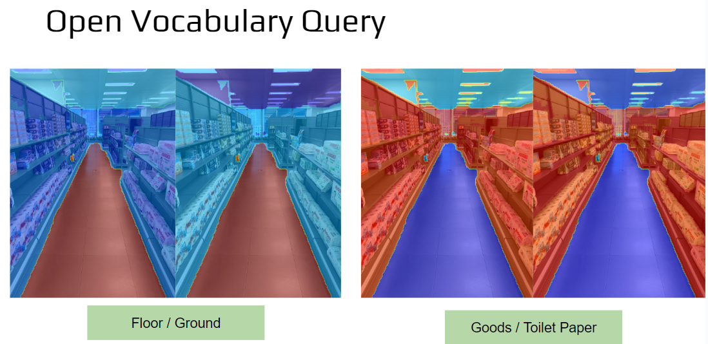
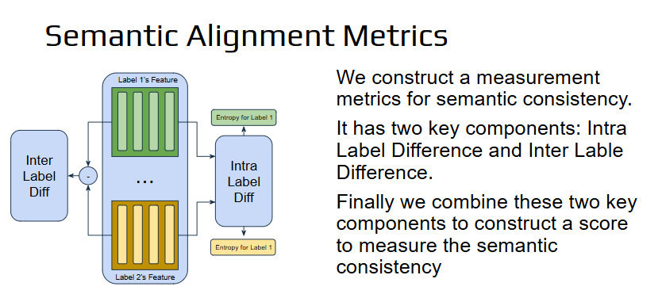
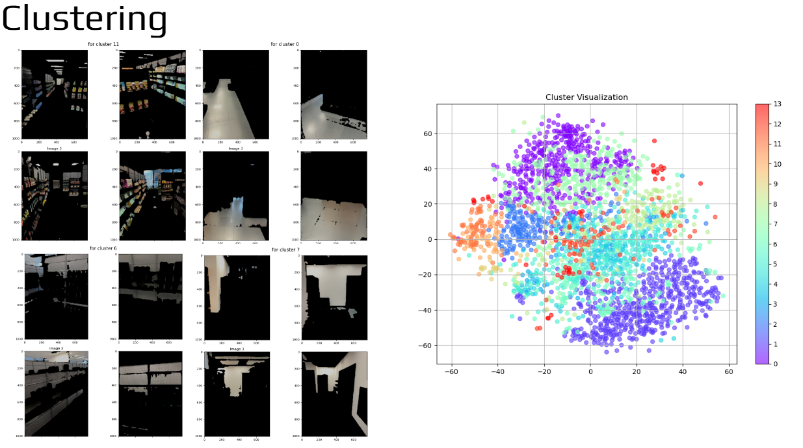
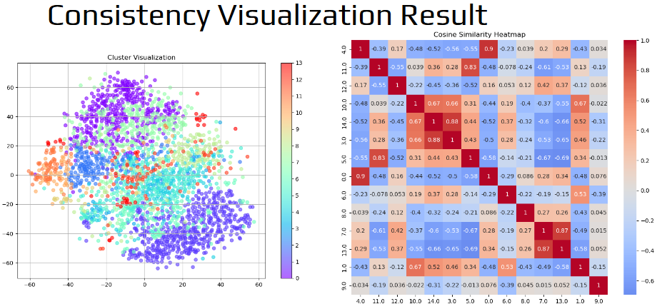
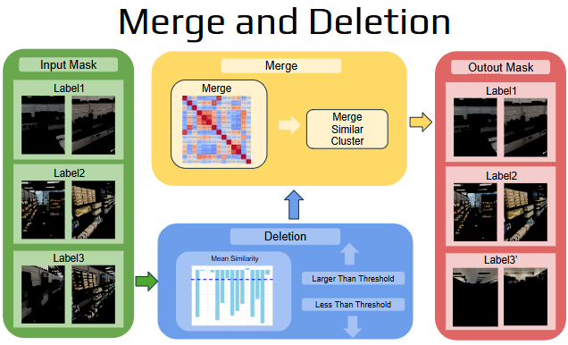
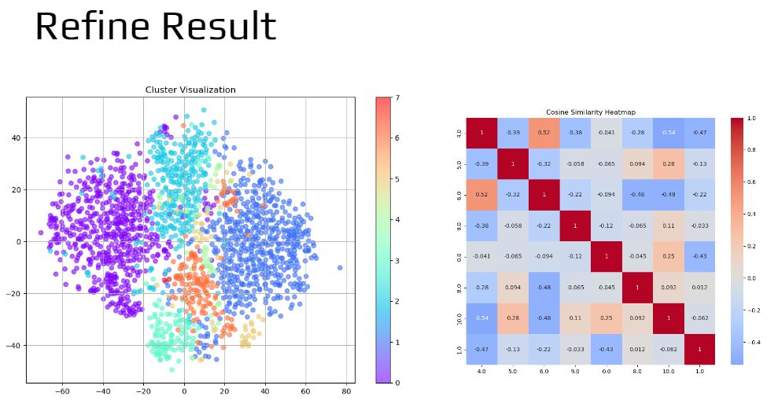
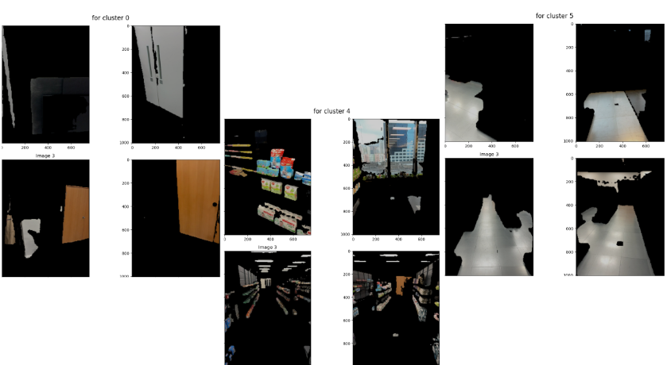

# Semantic Latent Retrival
This repository is used to get the semantic embedding for different region of the picture, and merge them together.
Since the features dot product is actually a linear operation, we therefore linearly sum features of each mask and global feature together to get the final feature repersentation.

Our repo shows a strong open volcabulary query ability



There are two part of our repository
- Semantic Part Generation
- Semantic Information Smoothing

## Environment Installation
Strictly follow what [SC_LATENT_SAM](https://github.com/saliteta/SC-latent-SAM) has done
And then run:
```
    pip install openclip
```

## Mask Preparation
Please strictly follow the code in [SC_LATENT_SAM](https://github.com/saliteta/SC-latent-SAM) refined semantic mask extraction to get a reliable masks. The refined mask and labels will be stored in the output directory like this:
```
refined_label.npz  refined_mask.npz  saved_features.npz  saved_labels.npz
```


## Semantic Part Generation
- For different semantic part, we need to get the semantic embedding. We need to use sc_latent_sam to generate multi-view consistant embedding
- We need to use the result generate by sc_latent_sam and original image to generate mask specific information
- We might need to construct a semantic consistancy score as a measurement metrics
### To run the code: 

```
CUDA_VISIBLE_DEVICES=2 python image_feature_generation.py \
    --clip_version ViT-B-16 \
    --clip_checkpoint /home/planner/xiongbutian/Foundation_Models/CLIP/open_clip_pytorch_model.bin \
    --image_dir /home/planner/xiongbutian/ignores/images \
    --mask_location /home/planner/xiongbutian/ignores/output/refined_mask.npz \
    --label_location /home/planner/xiongbutian/ignores/output/refined_label.npz \
    --output_dir /home/planner/xiongbutian/ignores/clip_result \
    --debugging False \
    --device cuda 
```
You need to modify the parameter accordingly

### To visualize the open vocabulary result
- Prepare the text one wants to input in some text file like shwon in ./discription
```
ceiling,ground,toilet paper
```
- Run the code:
```
CUDA_VISIBLE_DEVICES=2 python visualize.py \
    --clip_version ViT-B-16 \
    --clip_checkpoint /home/planner/xiongbutian/Foundation_Models/CLIP/open_clip_pytorch_model.bin \
    --image_location /home/planner/xiongbutian/ignores/images/frame_00002.jpg \
    --mask_location /home/planner/xiongbutian/ignores/output/refined_mask.npz \
    --feature_location /home/planner/xiongbutian/ignores/clip_result/semantic_features.npz \
    --text_discription /home/planner/xiongbutian/VLM_text_semantic_response/semantic_latent_retrival/discription/test.txt \
    --output_dir /home/planner/xiongbutian/ignores/clip_result/pictures \
    --device cuda 
```
modify the result accordingly

## Semantic Alignment Metrics
We create a semantic alignment metrics as follow: 

- We define the semantic consistancy as following. If the image feature one obtained is almost the same as within one cluster, the inter group semantic consistancy is well maintained. 
- We define the semantic consistancy between different group's prototype is large, then the inter group contrastivity is large
The method is defined here:

The visualized result is shown here:

This graph give some masked result and their clustered result

This shows the pair-wise similarity as heat map between different cluster

## Merge&Deletion
And after we check in detailed about the mask, we find that the mask some times overlapping with each others. To solve this problem we provide a smoothing stratgy
We call it merge-and-deletion
The method is displayed here:

<<<<<<< HEAD


## Result Display


=======
>>>>>>> 893896b9ad8263553cd0f19b797a270a941a3f35
